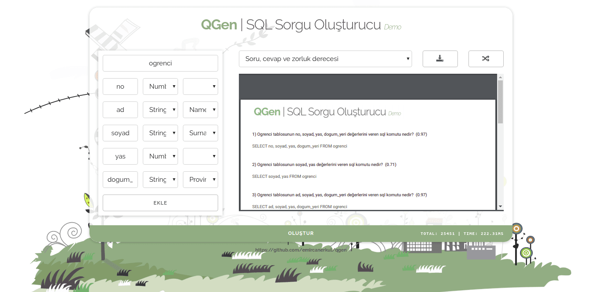

### QGen | SQL Sorgu Oluşturucu



#### Denemek için [tıklayınız](https://emircanerkul.github.io/qgen/)

#### Özellikler

- Şık, tüm cihazlarla uyumlu tasarım (750px üzeri genişliği olan cihazlar tavsiye edilir)
- Tüm işlemler sunucudan bağımsız olarak tamamen tarayıcıda gerçekleşmektedir.
- Tüm sorular kombinasyonel olarak hesaplanarak her bir teste benzersiz soru atanmaktadır.
- Zorluk derecesi Bezier eğrisi ile hesaplanabilmektedir.
- Tablo şablonu oluşturulan arşiv ile birlikte kaydedilip, kolayca tekrardan (ctrl+v) kısa yolu ile içe aktarılabilmektedir.
- Tabloya teorik olarak sınırsız nitelik eklenebilmektedir.
- Demo olan bu sürümde kısıtlı soru çeşitliliği bulunmaktadır.

#### Bilinen sorunlar

- Arşiv oluşturma aşaması esnasında işlemler ana thread'de gerçekleştiğinden yoğun işlem sonucu tarayıcı bir süre yanıt vermiyor gözükebilir.
- Her bir tabloda en az üç nitelik bulunmalıdır.

#### Geliştiricisine

- Projeyi klonlamak: git clone https://github.com/emircanerkul/qgen.git
- NPM bağımlılıklarını yüklemek: npm install
- Projeyi derlemek: npm install browserify -g && npm run build
- Derlemeyi sıkıştırmak: npm install uglify-es -g && npm run compress
- Otomatik derlemek: npm install npm-watch -g && npm-watch
- Docker ile geçici yerel server oluşturmak: docker run -v \$(pwd):/usr/share/nginx/html:ro -d -p 80:80 --rm nginx;

#### Kullanım

```js
const QGEN = require('./qgen.js');

let data = {
  ogrenci: {
    columns: {
      no: ['number'],
      ad: ['string', 'name'],
      soyad: ['string'],
      yas: ['number'],
      doğum_yeri: ['string', 'province']
    }
  },
  ilan: {
    columns: {
      no: ['number'],
      baslık: ['string'],
      aciklama: ['string'],
      yer: ['string', 'province']
    }
  }
};

let qGEN = new QGEN(data);
```

#### Çıktı

```json
{
  "structure": {
    "ogrenci": {
      "columns": {
        "no": ["number"],
        "ad": ["string", "name"],
        "soyad": ["string", "surname"],
        "yas": ["number"],
        "doğum_yeri": ["string", "province"]
      }
    },
    "ilan": {
      "columns": {
        "no": ["number"],
        "baslık": ["string"],
        "aciklama": ["string"],
        "yer": ["string", "province"]
      }
    }
  },
  "data": {
    "provinces": ["Adana", "Adıyaman", "Afyon", "..."],
    "male_names": ["Mehmet", "Ali", "Mustafa", "..."],
    "female_names": ["Fatma", "Ayşe", "Emine", "..."],
    "surnames": ["YILMAZ", "KAYA", "DEMIR", "..."]
  },
  "timing_fn": { "ease_out": "ƒ BezierEasing(x)" },
  "difficulties": {
    "q1": { "max": 1 },
    "q2": { "max": 3 },
    "q3": { "max": 6 }
  },
  "result": [
    {
      "question": "{table} tablosunun {columns} değerlerini veren sql komutu nedir?",
      "answer": "SELECT {columns} FROM {table}",
      "questions": ["..."],
      "answers": ["..."],
      "difficulties": ["..."]
    },
    {
      "question": "{table} tablosunun {columns} değerlerini {column} değerine göre {order} sıra ile veren sql komutu nedir?",
      "answer": "SELECT {columns} FROM {table} ORDER BY {column} {order}",
      "questions": ["..."],
      "answers": ["..."],
      "difficulties": ["..."]
    },
    {
      "question": "{table} tablosunun \"{column#province}\" verisi \"{province}\" değerine eşit olan {columns} değerlerini {column} değerine göre {order} sıra ile veren sql komutu nedir?",
      "answer": "SELECT {columns} FROM {table} WHERE {column#province}=\"{province}\" ORDER BY {column} {order}",
      "questions": ["..."],
      "answers": ["..."],
      "difficulties": ["..."]
    }
  ],
  "length": 35306,
  "time": 312.3249999998734
}
```

#### QGEN Bağımlılıkları

- [BezierEasing](https://www.npmjs.com/package/bezier-easing)

#### Proje Bağımlılıkları

- [QGEN](https://github.com/emircanerkul/qgen)
- [jsPDF](https://www.npmjs.com/package/jspdf)
- [jsZIP](https://www.npmjs.com/package/jszip)
- [fileSaver](https://www.npmjs.com/package/file-saver)
- [Base64](https://www.npmjs.com/package/js-base64)
- [alertify](https://www.npmjs.com/package/alertifyjs)

#### License

[](http://badges.mit-license.org)
